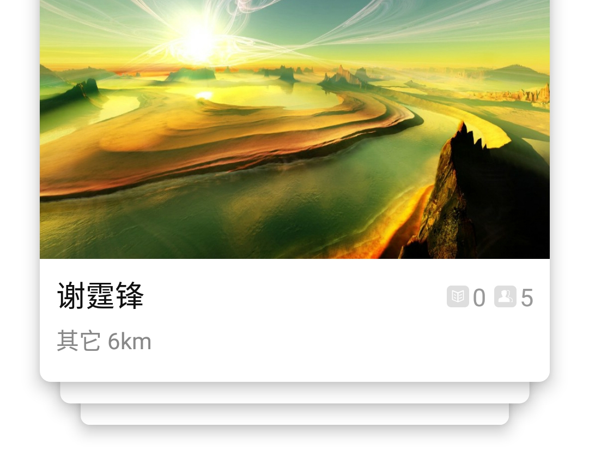

### 有图有真相
模仿探探首页的卡片滑动效果：<br><br>

不得不说，探探的ui效果真的很赞。在着手这个project之前，我没有参考过github上其它类似的开源项目。所以，如果这个project重复造了轮子，请不要打我。为了叙述上的方便，该项目代号为thisProj，没意见吧？<br>
在thisProj竣工之时，有一个小伙伴发了我另一个开源工程，跟thisProj也有相似之处。我下载了源码，导入了studio，apk跑起来的时候，发现它存在一些问题：卡片飞到两侧，如果动画没有结束，则不允许下一轮拖动。这对强迫症的用户来说，应该是很不爽的。<br>
然而，探探却克服了所有这些问题。或许，这个问题只有积淀过这些知识点的人才能琢磨的透吧。我确实思考了很久，想到了一个还不错的方案，细看代码深处，你也会如梦方醒吧。<br>

### 无耻一点
如果我能不要脸一些，我会说这个项目有以下优点：<br>
* 快。真的流畅，滑动的手速再快也赶不上代码刷新view的速度快。<br>
* 高效。仅仅四个卡片view轻松搞定任意多的数据。<br>
* 灵活。自定义ViewGroup对卡片view的高度实现了自适应。<br>
* 细节。卡片之间联动的视觉效果，是像素级的精确。<br>

不信，你下载下来look look。
### 使用方法
#### 1. 在xml文件中引入CardSlidePanel
```xml
<com.stone.card.CardSlidePanel
        android:id="@+id/image_slide_panel"
        android:layout_width="match_parent"
        android:layout_height="match_parent"
        card:bottomMarginTop="38dp"
        card:itemMarginTop="10dp"
        card:yOffsetStep="26dp">

        <LinearLayout
            android:id="@+id/card_bottom_layout"
            android:layout_width="fill_parent"
            android:layout_height="wrap_content"
            android:gravity="center"
            android:orientation="horizontal">

            <Button
                android:id="@+id/card_left_btn"
                android:layout_width="70dp"
                android:layout_height="70dp"
                android:background="@drawable/ignore_button" />

            <Button
                android:layout_width="40dp"
                android:layout_height="40dp"
                android:layout_marginLeft="10dp"
                android:background="@drawable/home_button" />

            <Button
                android:id="@+id/card_right_btn"
                android:layout_width="70dp"
                android:layout_height="70dp"
                android:layout_marginLeft="10dp"
                android:background="@drawable/like_button" />
        </LinearLayout>

        <com.stone.card.CardItemView
            android:layout_width="match_parent"
            android:layout_height="wrap_content"
            android:visibility="invisible" />

        <com.stone.card.CardItemView
            android:layout_width="match_parent"
            android:layout_height="wrap_content"
            android:visibility="invisible" />

        <com.stone.card.CardItemView
            android:layout_width="match_parent"
            android:layout_height="wrap_content"
            android:visibility="invisible" />

        <com.stone.card.CardItemView
            android:layout_width="match_parent"
            android:layout_height="wrap_content"
            android:visibility="invisible" />

    </com.stone.card.CardSlidePanel>
```
如果不想要底部的三个按钮，有两种办法：(1) 删代码，包括CardSlidePanel的一部分代码。(2)设置visibility为gone
#### 2. Java代码调用<br>
```java
CardSlidePanel slidePanel = (CardSlidePanel) rootView
                .findViewById(R.id.image_slide_panel);
        cardSwitchListener = new CardSwitchListener() {

            @Override
            public void onShow(int index) {
                Log.d("CardFragment", "正在显示-" + dataList.get(index).userName);
            }

            @Override
            public void onCardVanish(int index, int type) {
                Log.d("CardFragment", "正在消失-" + dataList.get(index).userName + " 消失type=" + type);
            }

            @Override
            public void onItemClick(View cardView, int index) {
                Log.d("CardFragment", "卡片点击-" + dataList.get(index).userName);
            }
        };
        slidePanel.setCardSwitchListener(cardSwitchListener);
```
#### 3. 想要定制卡片的itemView:<br>
请修改card_item.xml文件，可滑动区域在CardItemView.java里面做定制

#### 4.绑定卡片数据
在CardItemView.java
```java
public void fillData(CardDataItem itemData) {
        ImageLoader.getInstance().displayImage(itemData.imagePath, imageView);
        userNameTv.setText(itemData.userName);
        imageNumTv.setText(itemData.imageNum + "");
        likeNumTv.setText(itemData.likeNum + "");
    }
```

#### Demo安装包
[apk download](CardSlidePanel.apk) (就在thisProj工程之中)

## License

    Copyright 2016, xmuSistone

    Licensed under the Apache License, Version 2.0 (the "License");
    you may not use this file except in compliance with the License.
    You may obtain a copy of the License at

       http://www.apache.org/licenses/LICENSE-2.0

    Unless required by applicable law or agreed to in writing, software
    distributed under the License is distributed on an "AS IS" BASIS,
    WITHOUT WARRANTIES OR CONDITIONS OF ANY KIND, either express or implied.
    See the License for the specific language governing permissions and
    limitations under the License.

